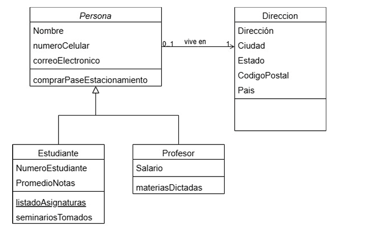

# Reto Práctico 1

### Punto 1
Construcción de las clases java, correspondientes al diagrama UML

### Punto 2
Definir el método constructor para cada una de las Clases: Persona, Dirección, Estudiante, Profesor (20 puntos)

### Punto 3
Construir una colección java dentro de una nueva clase denominada RepositorioEstudiante, e ingrese 10 estudiantes nuevos (20 puntos)

### Punto 4
Construir una nueva clase denominada ServiceEstudiante, y construya un método que: 
+ Liste todos los estudiantes. 
+ Filtre los estudiantes por el atributo nombre 
+ Filtre los estudiantes por el atributo numeroCelular 
+ Ordene los estudiantes por el atributo promedioNotas 

### Punto 5
Construir los 4 servicios del punto 4 como servicios REST dentro del framework spring boot
